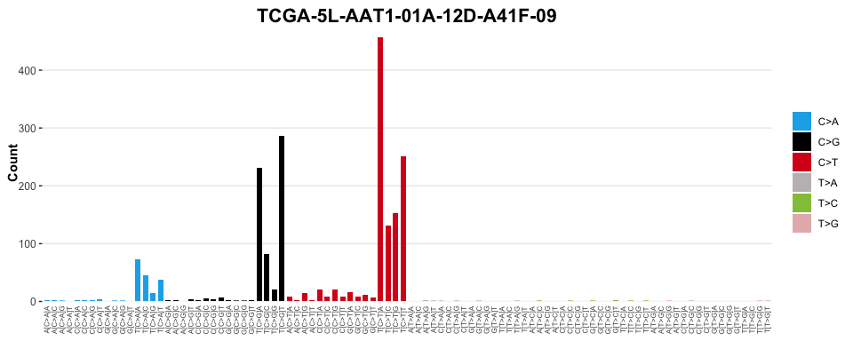
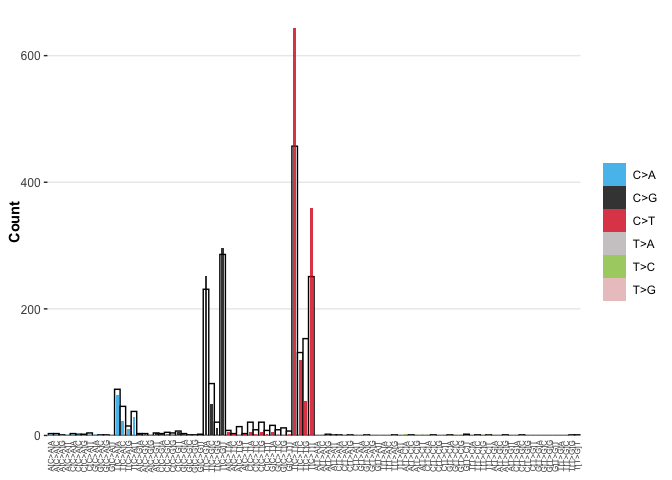

<!-- README.md is generated from README.Rmd. Please edit that file -->

# sigvis

<!-- badges: start -->

[](https://lifecycle.r-lib.org/articles/stages.html#experimental)
[](https://CRAN.R-project.org/package=sigvis)
[](https://github.com/selkamand/sigvis/actions/workflows/R-CMD-check.yaml)
<!-- badges: end -->

Create interactive visualisations that summarise mutational signature
analyses

## Installation

You can install the development version of sigvis like so:

``` r
if (!require("pak", quietly = TRUE))
    install.packages("pak")

pak::pak("selkamand/sigverse")
```

## Usage

### Visualise Signatures

``` r
library(sigvis)
library(sigstash)

# Load Signature
signatures <- sig_load("COSMIC_v3.3.1_SBS_GRCh38")

# Select just SBS2
SBS2 <- signatures[["SBS2"]]

# Plot
sig_visualise(signature = SBS2, title = "SBS2")
#> ✔ All channels matched perfectly to set [sbs_96]. Using this set for sort order
#> ✔ All types matched perfectly to set [sbs_type]. Using this set for sort order
#> ✔ Types matched perfectly to palette [snv_type]
```


### Visualise catalogues

``` r
# Load library containing results of TCGA mutational signature analysis
library(TCGAcatalogues)


# Load a catalogue
tally <- catalogues_load("BRCA", type = "SBS_96")

# Select a single sample of interest
sample = "TCGA-5L-AAT1-01A-12D-A41F-09"
tally_single_sample <- tally[[sample]]

tally_single_sample
#> # A tibble: 96 × 4
#>    channel type  fraction count
#>    <chr>   <chr>    <dbl> <int>
#>  1 A[C>A]A C>A   0.00151      3
#>  2 A[C>A]C C>A   0.00151      3
#>  3 A[C>A]G C>A   0.000503     1
#>  4 A[C>A]T C>A   0            0
#>  5 A[C>G]A C>G   0.00151      3
#>  6 A[C>G]C C>G   0.00151      3
#>  7 A[C>G]G C>G   0            0
#>  8 A[C>G]T C>G   0.00201      4
#>  9 A[C>T]A C>T   0.00402      8
#> 10 A[C>T]C C>T   0.00151      3
#> # ℹ 86 more rows
```

``` r

# Visualise Observed Mutational Profile
sig_visualise(tally_single_sample, class = "catalogue", title = sample)
#> ✔ All channels matched perfectly to set [sbs_96]. Using this set for sort order
#> ✔ All types matched perfectly to set [sbs_type]. Using this set for sort order
#> ✔ Types matched perfectly to palette [snv_type]
```



### Visualise a Signature Model

Visualise the catalogue expected from a signature model, where signature
‘SBS2’ explains 60% of the mutations in a sample, and ‘SBS13’ explains
the remaining 40%

``` r
# Load sigstats library for combining signature models
library(sigstats)

# Visualise a model (combination of signatures)
model = sig_combine(signatures, model = c('SBS2' = 0.6, 'SBS13' = 0.4), format = "combined")
sig_visualise(model, class = 'model', title = "Model", subtitle = "Combination of SBS2 (60%) and SBS13 (40%)")
#> ✔ All channels matched perfectly to set [sbs_96]. Using this set for sort order
#> ✔ All types matched perfectly to set [sbs_type]. Using this set for sort order
#> ✔ Types matched perfectly to palette [snv_type]
```


### Visualise a Signature Model Against the Observed Mutation Catalogue

Visualise the catalogue expected from a signature model, where signature
‘SBS2’ explains 60% of the mutations in a sample, and ‘SBS13’ explains
the remaining 40%, but overlay on top of the observed mutational process

``` r
library(sigstats) # For combining signature models
library(sigstash) # For pulling signatures
library(TCGAcatalogues) # For pulling example TCGA catalogue data

# Load Signature
signatures <- sig_load("COSMIC_v3.3.1_SBS_GRCh38")

# Create a model (combination of signatures)
model <- sig_combine(signatures, model = c('SBS2' = 0.6, 'SBS13' = 0.4), format = "signature")

# Load a catalogue (Tally of variant types)
tally <- catalogues_load("BRCA", type = "SBS_96")

# Get tally of a single sample
sample = "TCGA-5L-AAT1-01A-12D-A41F-09"
tally_single_sample <- tally[[sample]]

# Visualise the overlay
sig_visualise_compare_reconstructed_to_observed(
  catalogue = tally_single_sample,
  signature = model
)
#> ✔ All channels matched perfectly to set [sbs_96]. Using this set for sort order
#> ✔ All types matched perfectly to set [sbs_type]. Using this set for sort order
#> ✔ Types matched perfectly to palette [snv_type]
```


