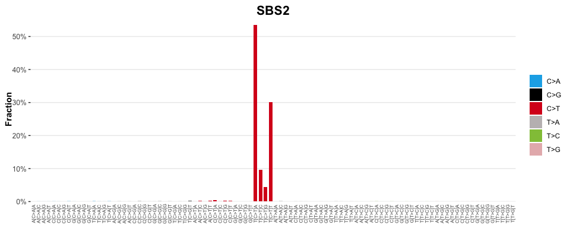

<!-- README.md is generated from README.Rmd. Please edit that file -->

# sigvis

<!-- badges: start -->

[](https://lifecycle.r-lib.org/articles/stages.html#experimental)
[](https://CRAN.R-project.org/package=sigvis)
<!-- badges: end -->

The goal of sigvis is to …

## Installation

You can install the development version of sigvis like so:

``` r
# install.packages('remotes')
remotes::install_github('selkamand/sigvis')
```

## Usage

### Visualise Signatures

``` r
library(sigstash)
library(sigvis)
library(TCGAdecomp)

# Load Signature 
signatures <- sig_load('COSMIC_v3.3.1_SBS_GRCh38')

# Visualise a single signature
sig_visualise(signatures[["SBS2"]])
#> ✔ All channels matched perfectly to set [sbs_96]. Using this set for sort order
#> ✔ All types matched perfectly to set [sbs_type]. Using this set for sort order
#> ✔ Types matched perfectly to palette [snv_type]
```



### Visualise Decompositions

``` r

# Load decompositions from sigstash
brca_decompositions <- decomp_load('BRCA')

# Visualise a decomposition
sig_visualise(brca_decompositions, 'TCGA-D8-A1XU')
```

### Visualise a Signature Model

``` r

# Visualise the decomposition expected from a signature model, where signature 'SBS1' explains 40% of the mutations in a sample, and 'SBS2' explains the remaining 40%

sig_visualise(signatures, model = c('SBS1' = 0.4, 'SBS2' = 0.6))
```
